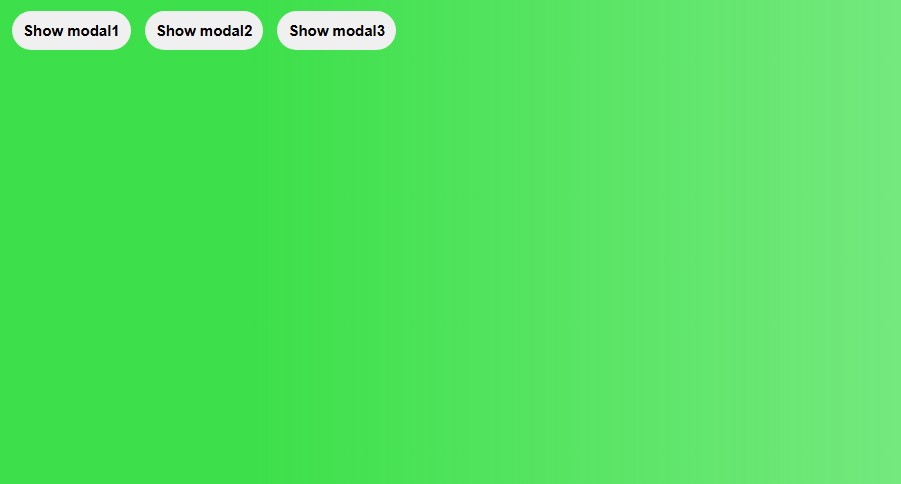
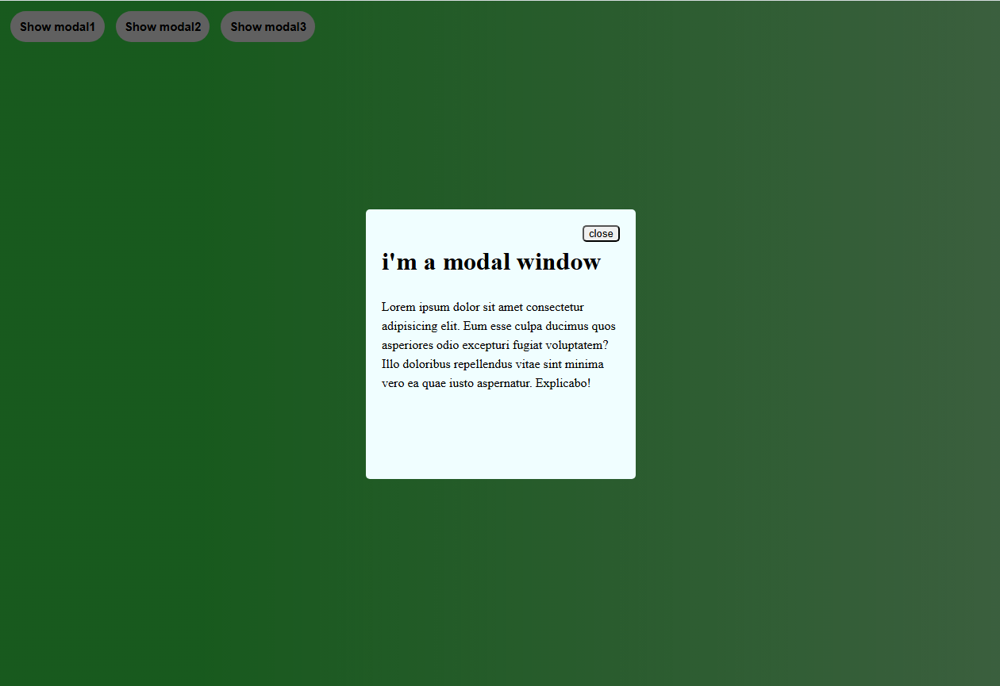

# 🪟 Modal Window

A simple interactive modal window project built with **HTML**, **CSS**, and **Vanilla JavaScript**.

This project focuses on practicing DOM manipulation, event handling, and creating interactive UI components using JavaScript.

---

## ✨ Features

- 🪟 Open modal window using multiple buttons
- ❌ Close modal using close button
- 🖱️ Close modal by clicking on the overlay
- ⌨️ Close modal using the Escape key
- 🎭 Show and hide elements dynamically
- 🔄 Manage CSS classes using JavaScript

---

## 🛠️ Technologies Used

- HTML5
- CSS3
- JavaScript (ES6)

### JavaScript Concepts Practiced

- DOM Manipulation
- querySelector()
- addEventListener()
- Functions
- Callback Functions
- Event Handling
- Keyboard Events
- classList
  - add()
  - remove()
  - contains()
- Conditional Statements

---

---

## 📸 Screenshots

### modals buttons

### open modal

---
